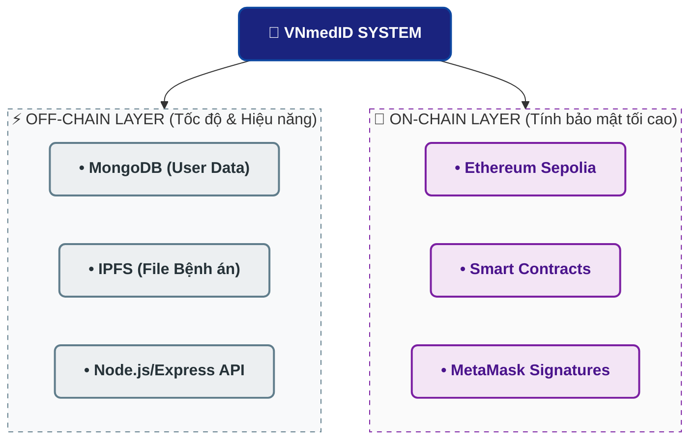
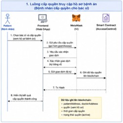
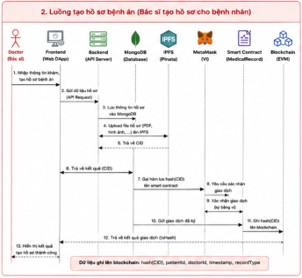
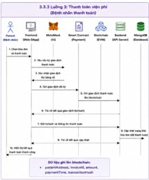

# 
🏥 VNmedID - Hệ thống quản lý hồ sơ y tế ứng dụng công nghệ Blockchain

  
  
  
  

---

### 📝 Tổng Quan Hệ Thống

**VNmedID (Vietnam Medical ID)** là một nền tảng phi tập trung (DApp) cấp cao giúp quản lý hồ sơ bệnh án điện tử (EMR), điều phối lượt khám lâm sàng và tự động hóa hóa đơn viện phí. 

Hệ thống hoạt động dựa trên cấu trúc **Mô Hình Lai (Hybrid Layer)** kết hợp cơ sở dữ liệu truyền thống (Off-chain) hiệu năng cao và mạng lưới Blockchain Ethereum Sepolia (On-chain) để bảo vệ tính toàn vẹn dữ liệu, giải quyết triệt để bài toán bảo mật thông tin nhạy cảm theo xu hướng chuyển đổi số y tế toàn dân.

> [!IMPORTANT]
> **HÀM LƯỢNG PHÁP LÝ TỐI CAO:** VNmedID được nghiên cứu và thiết kế cấu trúc tuân thủ nghiêm ngặt theo **Nghị định số 13/2023/NĐ-CP** của Chính phủ về bảo vệ dữ liệu cá nhân, đảm bảo quyền sở hữu dữ liệu tuyệt đối thuộc về chủ thể dữ liệu (Bệnh nhân).

---

## 🗺️ Mục Lục Hệ Thống (Table of Contents)
* [1. Thực Trạng Ngành & Lý Do Chọn Đề Tài](#-1-thực-trạng-ngành--lý-do-chọn-đề-tài)
* [2. Tính Cấp Thiết & Giải Pháp](#-2-tính-cấp-thiết--giải-pháp)
* [3. Kiến Trúc Phân Tách Dữ Liệu Lai (Hybrid Architecture)](#-3-kiến-trúc-phân-tách-dữ-liệu-lai-hybrid-architecture)
* [4. Cấu Trúc 6 Module Chức Năng Cốt Lõi](#-4-cấu-trúc-6-module-chức-năng-cốt-lõi)
* [5. Sơ Đồ Luồng Hoạt Động Hệ Thống](#-5-sơ-đồ-luồng-hoạt-động-hệ-thống)
* [6. Phân Tích Chuyên Sâu: Ưu Điểm & Hạn Chế](#-6-phân-tích-chuyên-sâu-ưu-điểm--hạn-chế)
* [7. Kế Hoạch Phát Triển Kỹ Thuật (Future Roadmap)](#-7-kế-hoạch-phát-triển-kỹ-thuật-future-roadmap)
* [8. Minh Bạch Smart Contract Địa Chỉ Deploy](#-8-minh-bạch-smart-contract-địa-chỉ-deploy)
* [9. Đội Ngũ Phát Triển (Team Members)](#-9-đội-ngũ-phát-triển-team-members)

---

## 📊 1. Thực Trạng Ngành & Lý Do Chọn Đề Tài

### 📉 Thực Trạng Hệ Thống Khép Kín
* **Tốc độ số hóa rời rạc:** Tính đến đầu năm 2026, dù có khoảng 73% số cơ sở y tế (1.210/1.650 bệnh viện) trên cả nước triển khai hồ sơ bệnh án điện tử (EMR), dữ liệu giữa các tuyến vẫn bị cô lập trong các "hòn đảo thông tin" (Data Silos). Điển hình tại TP.HCM đã đồng bộ cho hơn 2,3 triệu người dân qua Ứng dụng Công dân số nhưng việc liên thông liên viện vẫn gặp rào cản lớn.
* **Thách thức chuyển tuyến (Data Fragmentation):** Các hệ thống HIS/EMR hiện tại vận hành độc lập. Khi bệnh nhân chuyển viện, bác sĩ tuyến trên hoàn toàn không thể truy cập lịch sử điều trị ở tuyến dưới, bắt buộc phải làm lại các xét nghiệm đắt đỏ hoặc sử dụng bệnh án giấy lỗi thời.
* **Rủi ro sửa đổi nhật ký hệ thống:** Nhật ký truy cập (Log) trong cơ sở dữ liệu tập trung truyền thống có thể bị can thiệp bởi Admin máy chủ, gây mất tính pháp lý khi xảy ra sự cố y khoa.

### 💡 Giải Pháp Đột Phá Từ Blockchain
Blockchain đóng vai trò là một **Lớp hạ tầng xác thực dữ liệu tối cao (Source of Truth)** với 3 đặc tính then chốt:
1. **Tính bất biến (Immutability):** Vân tay số của hồ sơ (`RecordHash`) được lưu on-chain, ngăn chặn tuyệt đối mọi hành vi chỉnh sửa kết quả bệnh án.
2. **Khả năng truy vết (Traceability):** Nhật ký phân quyền được lưu vết dưới dạng Transaction công khai, có mốc thời gian rõ ràng.
3. **Mật mã học (Cryptography):** Trao toàn quyền quyết định dữ liệu cho Bệnh nhân thông qua cơ chế Chữ ký số cặp khóa Public/Private Key.

---

## ⚡ 2. Tính Cấp Thiết & Giải Pháp

* **Phá vỡ rào cản liên thông:** VNmedID thiết lập cổng kết nối ngang hàng giữa các bệnh viện đối tác mà không cần một siêu cơ sở dữ liệu tập trung đắt đỏ và rủi ro cao.
* **Trả lại quyền sở hữu thông tin:** Chỉ có bệnh nhân mới giữ chìa khóa tối cao để mở/khóa dữ liệu sức khỏe của mình cho bác sĩ chỉ định.
* **Minh bạch hóa đơn tài chính:** Triệt tiêu hoàn toàn rủi ro gian lận bảo hiểm y tế nhờ cơ chế thanh toán hóa đơn đối soát tự động, kiểm chứng độc lập qua Blockchain Transaction Hash.

---

## 🏗️ 3. Kiến Trúc Phân Tách Dữ Liệu Lai (Hybrid Architecture)

Để giải bài toán hiệu năng tốc độ xử lý UI/UX và chi phí lưu trữ đắt đỏ trên Blockchain, hệ thống phân tách nghiêm ngặt thành 2 lớp xử lý:

Để giải bài toán hiệu năng tốc độ xử lý UI/UX và chi phí lưu trữ đắt đỏ trên Blockchain, hệ thống phân tách nghiêm ngặt thành 2 lớp xử lý:

## 📦 4. Cấu Trúc 6 Module Chức Năng Cốt Lõi

Hệ thống được Module hóa độc lập để tối ưu hóa khả năng mở rộng (Scalability):

### 🔐 Module 1: Auth & Role Management
* **Nghiệp vụ:** Xác thực danh tính người dùng và điều hướng Dashboard động theo vai trò.
* **Kỹ thuật:** Sử dụng mã token **JWT (JSON Web Token)** quản lý phiên, đồng thời so khớp cặp ví MetaMask (`walletAddress`) với định danh tài khoản để khóa quyền ứng dụng.

### 👤 Module 2: Patient Management
* **Nghiệp vụ:** Quản lý vòng đời thông tin, lịch sử lâm sàng của Bệnh nhân.
* **Kỹ thuật:** Áp dụng mô hình dữ liệu nhúng (Embedded Data Model) trong **MongoDB** giúp tăng tốc độ truy vấn thông tin hành chính phức tạp chỉ với một câu lệnh đơn.

### 👨‍⚕️ Module 3: Doctor Management
* **Nghiệp vụ:** Tổ chức, điều phối danh mục nguồn lực và chuyên khoa y tế.
* **Kỹ thuật:** Xây dựng hệ thống RESTful API hỗ trợ bộ lọc động chuyên khoa và phòng khám trực tuyến theo thời gian thực.

### 📝 Module 4: Visit Record System (Lượt Khám & Bệnh Án)
* **Nghiệp vụ:** Trục xương sống kết nối luồng nghiệp vụ lâm sàng từ phòng chờ đến đơn thuốc.
* **Kỹ thuật:** Bác sĩ kê đơn $\rightarrow$ Hệ thống tự động băm dữ liệu thô $\rightarrow$ Đẩy tệp lên mạng phi tập trung **IPFS (Pinata)** lấy mã định danh nội dung `CID` $\rightarrow$ Lưu `CID` đối chứng về Database MongoDB.

### ⛓️ Module 5: Access Control (Core Blockchain)
* **Nghiệp vụ:** Cơ chế tối cao điều phối phân quyền hồ sơ bệnh án on-chain.
* **Kỹ thuật:** Khởi chạy Smart Contract `AccessControl.sol` tương tác qua thư viện `ethers.js`. Bác sĩ chỉ có thể xem tệp hồ sơ khi có giao dịch ký số cấp quyền hợp lệ từ ví cá nhân của bệnh nhân đó.

### 💳 Module 6: Invoice & Payment (Thanh Thanh Toán Viện Phí)
* **Nghiệp vụ:** Tự động hóa kế toán hóa đơn viện phí và tích hợp cổng thanh toán Web3.
* **Kỹ thuật:** Tổng hợp đơn thuốc thành hóa đơn tự động $\rightarrow$ Gọi hàm Smart Contract để bệnh nhân chuyển ETH Sepolia trực tiếp đến ví của Bệnh viện không qua bên trung gian thứ ba.

---

## 🎯 5. Sơ Đồ Luồng Hoạt Động Hệ Thống

Hệ thống điều phối dòng dữ liệu tuần tự, khép kín và an toàn tuyệt đối qua các sơ đồ luồng nghiệp vụ chuẩn hóa:

#### 🟢 Luồng Bệnh Nhân Cấp Quyền Truy Cập Hồ Sơ Cho Bác Sĩ

  

#### 🔵 Luồng Bác Sĩ Tiếp Nhận Khám & Tạo Hồ Sơ Bệnh Án Điện Tử

  

#### 🔴 Luồng Bệnh Nhân Ký Duyệt & Thanh Toán Hóa Đơn Web3

  

---

## 💎 6. Phân Tích Chuyên Sâu: Ưu Điểm & Hạn Chế

### ✅ Ưu Điểm Nổi Bật (Strengths)
* **Kiến trúc Lai tối ưu hóa chi phí:** Sự kết hợp giữa MongoDB + IPFS + Blockchain giải quyết triệt để bài toán thắt nút cổ chai về chi phí lưu trữ lớn on-chain nhưng giữ nguyên được tính toàn vẹn của dữ liệu y tế.
* **Phản hồi giao diện mượt mà (Zero UI Lag):** Hệ thống tích hợp **Event Listener** ở Backend để lắng nghe trạng thái thay đổi từ Smart Contract, sau đó cập nhật đồng bộ trực tiếp vào MongoDB giúp Frontend đọc dữ liệu tức thời, loại bỏ thời gian chờ 20-30s xử lý khối của Blockchain truyền thống.
* **Kiến trúc Module hóa:** Tách biệt độc lập Frontend, Backend và Smart Contract giúp hệ thống sẵn sàng cắm rút, liên kết vào hệ thống HIS có sẵn tại các bệnh viện.

### ⚠️ Hạn Chế Hiện Tại (Weaknesses)
* **Bảo mật tầng IPFS:** Các tệp hồ sơ bệnh án đẩy lên cổng Pinata hiện tại ở dạng thô chưa mã hóa nội dung gốc, có rủi ro nếu lộ mã CID công khai.
* **Sự phụ thuộc vào Khóa Cá Nhân:** Người dùng nếu làm mất Private Key của ví MetaMask sẽ mất vĩnh viễn quyền kiểm soát và truy xuất thông tin lịch sử y tế của mình.
* **Rào cản trải nghiệm Web3:** Thầy cô và người dùng phổ thông sẽ gặp bỡ ngỡ khi hệ thống bắt buộc phải cài đặt ví và sở hữu ETH Sepolia để thanh toán gas giao dịch.

---

## 🚀 7. Kế Hoạch Phát Triển Kỹ Thuật (Future Roadmap)

> [!NOTE]
> Để chuẩn bị thương mại hóa dự án thực tế, đội ngũ kỹ thuật phát triển định hướng giải quyết các bài toán hạn chế theo 3 trục công nghệ chính:

1. **Mã Hóa Dữ Liệu Đầu Cuối (Client-Side Encryption):** Tích hợp thuật toán mã hóa bất đối xứng trước khi tải file lên IPFS. Sử dụng Public Key của bệnh nhân để khóa dữ liệu, đảm bảo chỉ duy nhất Private Key hợp lệ sở hữu mới giải mã được nội dung bệnh án.
2. **Triển Khai Mạng Lưới Layer 2 / Consortium:** di chuyển mã nguồn Smart Contract sang giải pháp **Layer 2 (Polygon / Optimism)** giúp nén giao dịch, hạ chi phí phí gas xuống mức dưới 1.000 VNĐ/giao dịch hoặc chuyển sang mô hình **Consortium Blockchain (Hyperledger Fabric)** để triệt tiêu hoàn toàn phí gas giao dịch lẻ của người dân.
3. **Account Abstraction (ERC-4337):** Áp dụng tính năng Social Recovery (khôi phục ví bằng Email/Mạng xã hội) và cơ chế **Gasless Transaction** (Bệnh viện đứng ra tài trợ phí gas cho bệnh nhân) nhằm xóa bỏ hoàn toàn rào cản cài đặt ví kỹ thuật phức tạp đối với bệnh nhân lớn tuổi.

---

## 📂 8. Minh Bạch Smart Contract Địa Chỉ Deploy

Hệ thống bao gồm 4 hợp đồng thông minh cốt lõi độc lập được triển khai thành công trên mạng thử nghiệm **Ethereum Sepolia Testnet**:

| Tên Smart Contract | Địa Chỉ Hợp Đồng (Smart Contract Address) | Mô Tả Trách Nhiệm Chức Năng |
| :--- | :--- | :--- |
| **UserRegistry.sol** | `0xcE59a642cf88C19400fAEDC44c3613Ee599F6470` | Quản lý danh tính và phân quyền các vai trò cốt lõi (Admin, Bác sĩ, Bệnh nhân) on-chain. |
| **AccessControl.sol** | `0x0ec7E8945a17553A7960b10b12072DA2d86cdD20` | Lưu trữ trạng thái và xử lý luồng logic cấp/thu hồi quyền truy cập hồ sơ bệnh án liên viện. |
| **MedicalRecord.sol** | `0x3BaBACBA78d7F3db95c07CB106A586019fdb73Cb` | Lưu trữ vĩnh viễn mã băm đối chứng RecordHash (IPFS CID) để đảm bảo tính bất biến. |
| **PaymentInvoice.sol**| `0x0eD8F3cA220C85Bd7976fB0136f72B6b5aB3CB85c` | Tiếp nhận dòng tiền viện phí crypto trực tiếp, kích hoạt Event đối soát thanh toán tự động. |

---

---

## 👥 9. Đội Ngũ Phát Triển (Team Members)

Hệ thống được nghiên cứu và phát triển bởi các thành viên thuộc nhóm đề tài **VNmedID**:

| Avatar | Họ và Tên | Vai Trò (Role) | GitHub Profile |
| :---: | :--- | :--- | :--- |
|  | **Nguyễn Hoàng Gia Việt Hưng** | Trưởng nhóm / Fullstack Developer / Smart Contract | [nguynhoanggiaviethung-beep](https://github.com/nguyenhoanggiaviethung-beep) |
|  | **Hoàng Thị Minh Anh** | Backend Developer / DevOps | [@MinhAnhFintech](https://github.com/MinhAnhFintech) |
|  | **Trương Thị Khánh Hưng** | Researcher / DevOps | [@kzh-hwq](https://github.com/kzh-hwq) |
|  | **Lê Thị Minh Thư** | Frontend Developer / UI/UX | [@minhthu6606-stack](https://github.com/minhthu6606-stack) |
|  | **Nguyễn Lê Phương Nga** | Researcher / DevOps | ([@pnga1206](https://github.com/pnga1206)) |
|  | **Lê Anh Thư** | Tester / DevOps | [@cauvongden01-hub](https://github.com/cauvongden01-hub) |
|  | **Võ Thị Tuyết Kha** | Blockchain Engineer / DevOps | [@waazei](https://github.com/waazei) |
|  | **Trần Hoàng Thịnh** | Blockchain Engineer / DevOps | [@AlexanderJhinh](https://github.com/AlexanderJhinh) |

Developed with ❤️ by VNmedID Technical Team - 2026

